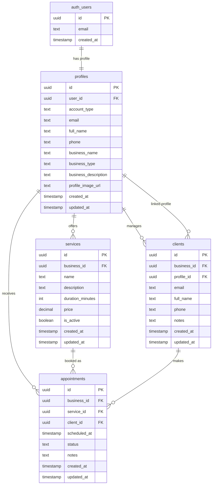

# SimpleBook SaaS 📚

A modern, full-featured appointment booking platform designed for small businesses to manage their services and client appointments efficiently.

## 🎯 Overview

SimpleBook is a multi-tenant SaaS application that enables business owners to create a professional booking platform for their clients. Clients can browse services, select dates/times, and book appointments seamlessly. The platform features a complete admin dashboard for business management and a public booking interface.

### Key Features
- ✅ **Multi-tenant Architecture** - Each business has its own isolated data
- ✅ **Service Management** - Create, update, and manage services with pricing and duration
- ✅ **Appointment Scheduling** - Client booking with automatic confirmation
- ✅ **Business Dashboard** - Complete admin panel for appointment and client management
- ✅ **Authentication** - Secure JWT-based authentication with Supabase
- ✅ **Role-Based Access** - Separate interfaces for business owners and clients
- ✅ **Responsive Design** - Mobile-first Bootstrap 5 UI for all screen sizes

## 🛠️ Technology Stack

| Category | Technology |
|----------|-----------|
| **Frontend** | HTML5, CSS3, Vanilla JavaScript (ES Modules) |
| **UI Framework** | Bootstrap 5 |
| **Build Tool** | Vite 7.3.1 |
| **Runtime** | Node.js 18+ |
| **Backend** | Supabase (PostgreSQL, Auth, REST API) |
| **Database** | PostgreSQL with Row-Level Security (RLS) |
| **Package Manager** | npm |
| **Version Control** | Git |

## 📁 Project Structure

```
simplebook-saas/
├── .github/
│   └── copilot-instructions.md    # AI agent guidelines & architecture context
├── src/
│   ├── modules/
│   │   └── auth.js                # Supabase authentication logic
│   ├── pages/
│   │   ├── login.js               # Login page handler
│   │   ├── register.js            # Registration page handler
│   │   ├── dashboard.js           # Business owner dashboard
│   │   └── booking.js             # Client booking interface
│   ├── services/
│   │   └── supabase.js            # Supabase client & database operations
│   ├── utils/
│   │   ├── validators.js          # Form validation helpers
│   │   ├── formatters.js          # Date/time/text formatting
│   │   └── constants.js           # Application constants
│   ├── main.js                    # Global initialization
│   └── style.css                  # Global styles
├── public/                        # Static assets (images, icons, etc.)
├── index.html                     # Landing page
├── login.html                     # User authentication
├── register.html                  # New user registration
├── dashboard.html                 # Business owner admin panel
├── booking.html                   # Public appointment booking
├── vite.config.js                 # Vite configuration
├── package.json                   # Dependencies & scripts
└── README.md                      # This file
```

## 🗄️ Database Schema

### Core Tables

#### 1. **profiles** - User profiles (business owners & clients)
```sql
- id (UUID, Primary Key)
- user_id (UUID, Foreign Key → auth.users)
- account_type (ENUM: 'business' | 'client')
- email (TEXT, unique)
- full_name (TEXT, for clients)
- phone (TEXT, optional)
- business_name (TEXT, for business owners)
- business_type (TEXT, for business owners)
- business_description (TEXT, optional)
- profile_image_url (TEXT, optional)
- created_at (TIMESTAMP)
- updated_at (TIMESTAMP)
```

#### 2. **services** - Services offered by business owners
```sql
- id (UUID, Primary Key)
- business_id (UUID, Foreign Key → profiles)
- name (TEXT)
- description (TEXT, optional)
- duration_minutes (INTEGER)
- price (DECIMAL)
- is_active (BOOLEAN)
- created_at (TIMESTAMP)
- updated_at (TIMESTAMP)
```

#### 3. **clients** - Client contact information
```sql
- id (UUID, Primary Key)
- business_id (UUID, Foreign Key → profiles)
- profile_id (UUID, Foreign Key → profiles, nullable for unregistered clients)
- email (TEXT)
- full_name (TEXT)
- phone (TEXT, optional)
- notes (TEXT, optional)
- created_at (TIMESTAMP)
- updated_at (TIMESTAMP)
```

#### 4. **appointments** - Appointment records
```sql
- id (UUID, Primary Key)
- business_id (UUID, Foreign Key → profiles)
- service_id (UUID, Foreign Key → services)
- client_id (UUID, Foreign Key → clients)
- scheduled_at (TIMESTAMP)
- status (ENUM: 'pending' | 'confirmed' | 'completed' | 'cancelled')
- notes (TEXT, optional)
- created_at (TIMESTAMP)
- updated_at (TIMESTAMP)
```

### ER Diagram



## 🚀 Getting Started

### Prerequisites
- Node.js 18+ installed
- npm or yarn
- Supabase account (free tier available)

### Installation

1. **Clone the repository**
```bash
git clone <repository-url>
cd simplebook-saas
```

2. **Install dependencies**
```bash
npm install
```

3. **Setup environment variables**
Create a `.env.local` file in the root directory:
```
VITE_SUPABASE_URL=https://your-project.supabase.co
VITE_SUPABASE_ANON_KEY=your-anon-key-here
```

Get these values from your Supabase project settings:
- Go to [Supabase Dashboard](https://app.supabase.com)
- Select your project
- Settings → API → Copy the URL and `anon` key

4. **Start the development server**
```bash
npm run dev
```

The app will be available at `http://localhost:5173`

## 📚 Development Commands

```bash
# Start development server (Vite)
npm run dev

# Build for production
npm run build

# Preview production build locally
npm run preview

# Format code (if formatter is configured)
npm run format

# Lint code (if linter is configured)
npm run lint
```

## 📖 Application Flow

### 1. **Landing Page (index.html)**
Entry point showcasing product features, pricing, and call-to-action buttons.

### 2. **Authentication**
- **Register (register.html)**: New users select account type (business owner or client)
- **Login (login.html)**: Existing users authenticate with email/password
- Account type determines user's experience and permissions

### 3. **Business Owner Dashboard (dashboard.html)**
After login, business owners access:
- **Overview**: Statistics (total appointments, clients, services)
- **Services**: Create, edit, and manage available services
- **Appointments**: View booked appointments, change status
- **Clients**: Manage client contacts and notes

Business ID is the `profiles.id` of the logged-in business owner.

### 4. **Client Booking (booking.html)**
Public booking interface accessed via business-specific URL (with business_id parameter):
- Browse business services with descriptions and pricing
- Select service and preferred time slot
- Enter contact information (auto-filled if registered)
- Confirm booking (creates appointment record)

## 🔐 Security

### Row-Level Security (RLS)
All database tables implement RLS policies:
- **profiles table**: Users can view/edit only their own profile
- **services table**: Business owners can manage only their services; clients can view active services
- **clients table**: Only the business owner can manage their clients
- **appointments table**: Business owners see their appointments; clients see their booked appointments

### Authentication
- Supabase Authentication using JWT tokens
- Passwords are hashed and never transmitted
- Session tokens are stored securely in browser storage

## 👥 User Roles

### Business Owner
- Register with business details (name, type, description)
- Create and manage services
- View client list
- Manage appointments (confirm, cancel, mark complete)
- Access full admin dashboard

### Client
- Register with basic profile (name, phone)
- Browse business services (if authenticated)
- Book appointments
- View own appointments
- Track booking status

## 🔄 Key Workflows

### Creating a Service
1. Business owner logs in to dashboard
2. Navigates to "Services" section
3. Fills form: service name, description, duration, price
4. Submits to create service in database
5. Service appears in client booking page

### Booking an Appointment
1. Client accesses booking page with business ID
2. Selects service from available options
3. Chooses preferred date and time
4. Enters contact information
5. Reviews booking summary
6. Confirms booking (creates appointment + client record)
7. Receives confirmation

### Managing Appointments
1. Business owner views appointments in dashboard
2. Can see: client name, service, scheduled time, status
3. Can update status: pending → confirmed → completed/cancelled
4. Can add/edit notes for appointment

## 🌐 Deployment

The application is built as a Vite SPA with a Node.js backend (Supabase).

### Production Build

Before deploying, create a production build:

```bash
npm run build
```

This generates optimized files in the `dist/` folder:
- Minified HTML/CSS/JavaScript
- Optimized bundle size (~16KB gzipped)
- Source maps for debugging

**Requirements for deployment:**
1. `.env.local` converted to deployment environment variables
2. Supabase project URL and API key configured
3. Supabase Storage bucket "user-uploads" created (see Storage Setup)
4. RLS policies enabled on all tables

### Storage Setup (Required for File Uploads)

Before deploying, create the Supabase Storage bucket:

1. Go to [Supabase Dashboard](https://app.supabase.com) → Your Project
2. Navigate to **Storage** → **Buckets**
3. Click **Create a new bucket**
4. Enter name: `user-uploads`
5. Toggle **Public bucket** to ON
6. Save the bucket

Then set the bucket path:
```
Profile pictures: storage/v1/object/public/user-uploads/profile-pictures/
Documents: storage/v1/object/public/user-uploads/documents/
```

### Deploying to Netlify

**Option 1: Git-based deployment (Recommended)**

1. Push your code to GitHub
2. Go to [Netlify](https://app.netlify.com)
3. Click **Add new site** → **Import an existing project**
4. Select your GitHub repository
5. Build command: `npm run build`
6. Publish directory: `dist`
7. Set environment variables:
   - `VITE_SUPABASE_URL`: Your Supabase URL
   - `VITE_SUPABASE_ANON_KEY`: Your Supabase API key
8. Click **Deploy**

**Option 2: Manual deployment (Drag & Drop)**

```bash
npm run build
```

Then drag the `dist` folder to [Netlify](https://app.netlify.com/drop)

### Deploying to Vercel

**Option 1: Git-based deployment**

1. Push your code to GitHub
2. Go to [Vercel](https://vercel.com/new)
3. Import your GitHub repository
4. Framework: **Vite**
5. Build: `npm run build`
6. Output: `dist`
7. Add environment variables:
   - `VITE_SUPABASE_URL`
   - `VITE_SUPABASE_ANON_KEY`
8. Click **Deploy**

**Option 2: CLI deployment**

```bash
npm install -g vercel
npm run build
vercel --prod
```

### Deploying to Other Platforms

**GitHub Pages:**
```bash
npm run build
# Deploy dist/ to gh-pages branch
```

**Traditional Hosting (cPanel, etc.):**
```bash
npm run build
# Upload dist/ folder via FTP/SFTP
```

### Post-Deployment Checklist

- [ ] ✅ Storage bucket "user-uploads" created
- [ ] ✅ Environment variables configured (Supabase URL, API key)
- [ ] ✅ App loads without errors in network tab
- [ ] ✅ Login/Register pages work
- [ ] ✅ Dashboard loads for business accounts
- [ ] ✅ Profile picture upload works
- [ ] ✅ Services and appointments appear
- [ ] ✅ Booking page loads with correct business ID

### Verify Deployment

After deploying, test:

```bash
# Test landing page
curl https://your-deployed-url.com/index.html

# Test auth
curl https://your-deployed-url.com/login.html

# Test API connectivity (check browser console for errors)
# Open dashboard and check Network tab in DevTools
```

If you encounter issues:
1. Check browser DevTools → **Console** for errors
2. Check DevTools → **Network** tab for failed API calls
3. Verify Supabase URL and API key are correct
4. Ensure RLS policies are configured correctly

## 📱 Responsive Design

- **Mobile First**: All pages optimized for mobile (320px+)
- **Bootstrap 5 Grid**: Responsive containers and flex utilities
- **Touch-Friendly**: Large buttons and inputs for mobile devices
- **Adaptive Navigation**: Mobile-optimized menu and spacing

## 🛡️ Best Practices Implemented

✅ **Code Organization**
- Modular architecture with separation of concerns
- ES modules for code splitting and reusability
- Clear naming conventions (camelCase, PascalCase)

✅ **Database Design**
- Normalized schema to prevent data duplication
- Foreign key constraints for data integrity
- Indexes on frequently queried fields
- Row-level security for data privacy

✅ **Frontend Development**
- Semantic HTML for accessibility
- Bootstrap utility classes for responsive design
- Form validation before submission
- Error handling with user-friendly messages
- Loading states to prevent duplicate submissions

✅ **Git Workflow**
- Descriptive commit messages
- Regular commits for each feature
- Clean commit history

## 🧪 Testing the Application

### Demo Credentials
After seeding the database, use these test accounts:

**Business Owner Account:**
- Email: `business@demo.com`
- Password: `demo123456`

**Client Account:**
- Email: `client@demo.com`
- Password: `demo123456`

## 📝 Environment Configuration

The application requires Supabase credentials. Create `.env.local`:

```
VITE_SUPABASE_URL=https://your-project.supabase.co
VITE_SUPABASE_ANON_KEY=eyJhbGciOiJIUzI1NiIsInR5cCI6IkpXVCJ9...
```

**Note**: The `.env.local` file is NOT committed to Git. Each developer must create their own.

## 🐛 Troubleshooting

### "Cannot read property '_config' of undefined"
- Ensure `.env.local` exists with valid Supabase credentials
- Reload the page after creating `.env.local`

### "Row-level security violation"
- Check that you're logged in with correct account type
- Verify Supabase RLS policies are enabled
- Check that your user ID is correctly stored in profiles table

### Services not loading
- Verify services exist in database for the business
- Check Supabase API key is correct
- Open browser DevTools → Network tab to see API responses

## 📞 Support & Questions

For setup issues or questions:
1. Check the Environment Configuration section above
2. Review the `.github/copilot-instructions.md` for architecture details
3. Verify Supabase project settings and API keys

## 📄 Related Documentation

- [Supabase Documentation](https://supabase.com/docs)
- [Bootstrap 5 Documentation](https://getbootstrap.com/docs/5.0/)
- [Vite Documentation](https://vitejs.dev/guide/)
- [MDN JavaScript Documentation](https://developer.mozilla.org/en-US/docs/Web/JavaScript/)

## 📈 Future Enhancements

- Email notifications for appointment confirmations
- SMS reminders for upcoming appointments
- Calendar view for appointment scheduling
- Payment integration for online booking
- Availability templates (recurring time slots)
- Analytics dashboard for business insights
- Multi-language support
- Integration with Google Calendar

## 📜 License

This project is part of a web development capstone assignment.

---

**Last Updated**: March 2, 2026  
**Version**: 1.0.0  
**Status**: Active Development

